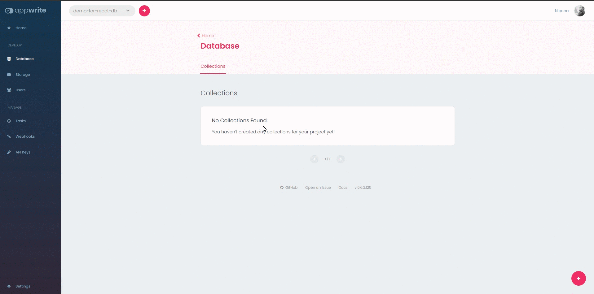
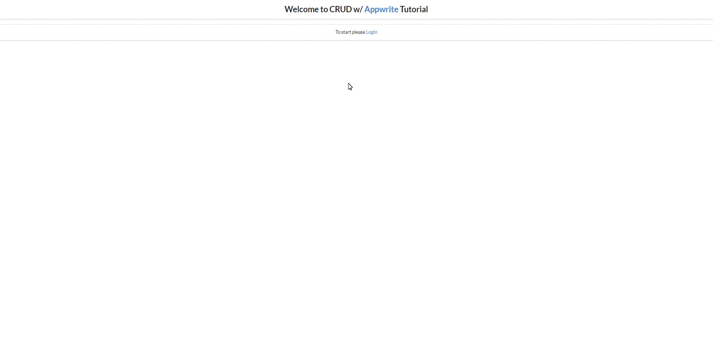
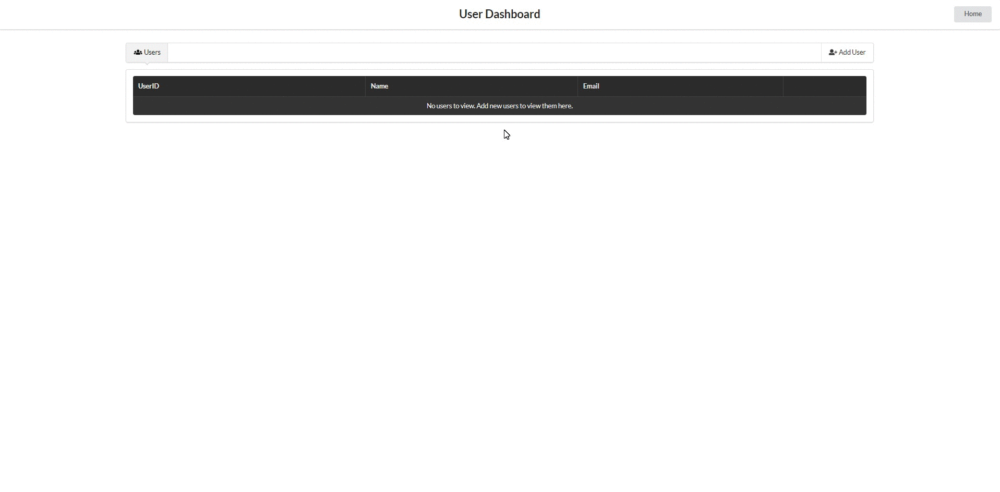
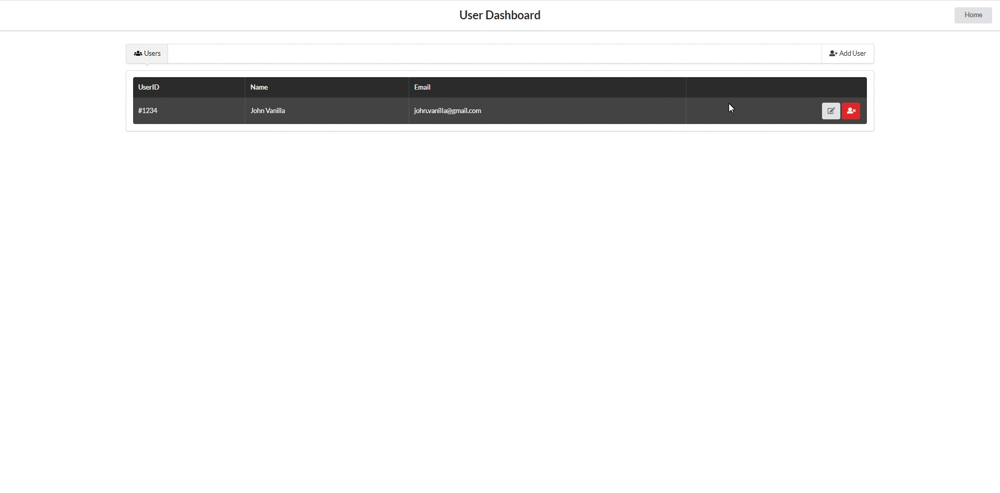
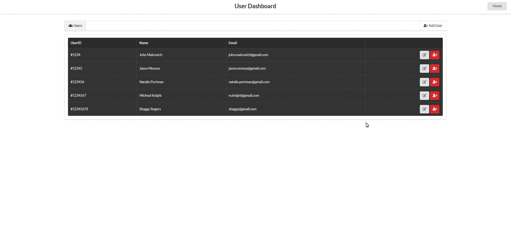

# Appwrite + ReactJS = ❤

This example is to show how to do CRUD (CREATE, READ, UPDATE, DELETE) operations using [Appwrite's JS API](https://github.com/appwrite/sdk-for-js) with [React](https://reactjs.org/).

## Prerequisites

- A Recent Version of [NodeJS](https://nodejs.org/en/)
- [NPM](https://www.npmjs.com/)
- [A locally running Appwrite instance](https://appwrite.io/docs/installation).
- Completed the [example-auth](https://github.com/appwrite/demos-for-react/tree/master/example-auth) tutorial (I assume that you have knowledge in using login endpoint in Appwrite.)

## Getting Started

To get started quickly you can follow the [initial tutorial](https://github.com/appwrite/demos-for-react/tree/master/example-auth).

In this tutorial we are going to use the Appwrite's API to create documents, read, update and delete them.

First you have to create a collection in Appwrite's console. (In the [initial tutorial](https://github.com/appwrite/demos-for-react/tree/master/example-auth), you should have created a project in the Appwrite console.)



Now find the Collection ID and keep it copied since we are going to need it.

## Development

Enough with the theories, now let's move on to the real deal. Let's see how our React app is structured.

1. All the actions will be inside `/src/actions` directory
2. All the components will be inside `/src/components` directory
3. Configuration file is inside `/src/config` directory
4. Helper functions will be inside `/src/helpers` directory

Now Let's create our `/src/App.js` file.

```js
import React from "react";
import Routes from "./routes";
import "semantic-ui-css/semantic.min.css";

const App = () => {
  return <Routes />;
};

export default App;
```

I have used [Semantic UI React](https://react.semantic-ui.com/) as the CSS framework.

Now let's create the `/src/routes.js` file.

```js
import React from "react";
import { BrowserRouter as Router, Route, Switch } from "react-router-dom";
import Home from "./components/Home";
import Login from "./components/Login";
import Users from "./components/Users";

const Routes = () => {
  return (
    <Router>
      <Switch>
        <Route exact path={"/"} render={props => <Home {...props} />} />
        <Route exact path={"/users"} render={props => <Users {...props} />} />
        <Route exact path={"/login"} render={props => <Login {...props} />} />
        <Route exact path={"*"} component={Home} /> //If the route does not matches
        it will return the homepage
      </Switch>
    </Router>
  );
};

export default Routes;
```

Here we only create three routes. One for our homepage, one for the User Dashboard and another one for Login page.

Now let's create the Homepage inside `/src/components/Login/index.js`

```js
import React, { useEffect, useState } from "react";
import { Button, Form, Grid, Message, Segment } from "semantic-ui-react";
import { Link, useHistory } from "react-router-dom";
import { getUserData, login } from "../../actions";
import Spinner from "../../helpers/Spinner";

const Login = () => {
  const history = useHistory();

  const [profile, setProfile] = useState(null);
  const [email, setEmail] = useState("");
  const [password, setPassword] = useState("");
  const [loading, setLoading] = useState(true);
  const [error, setError] = useState(null);

  useEffect(() => {
    //retrieving user profile data from the backend when the Login component is mounted (Similar to the use of componentDidMount())
    getUserData() //this function is declared in '/src/actions/index.js' file
      .then(response => {
        setProfile(response);
        setLoading(false);
      })
      .catch(e => {
        console.log(e.message);
        setLoading(false);
        setProfile(false);
      });
  }, []);

  useEffect(() => {
    //redirecting to User Dashboard if the user is already logged in
    if (profile) {
      history.push("/users");
    }
  }, [history, profile]);

  const loginHandler = () => {
    //by providing email and password, the user is logged in and redirected to the User Dashboard
    login(email, password) //this function is declared in '/src/actions/index.js' file
      .then(() => history.push("/users"))
      .catch(err => {
        setError(err.message);
      });
  };

  //if the user is not logged in and the loading is completed, the login component is shown. Otherwise, a Spinner will be shown.
  if (profile === false && loading === false) {
    return (
      <Grid>
        <Grid.Row columns={1}>
          <Grid.Column>
            <Segment textAlign={"center"}>User Login</Segment>
          </Grid.Column>
        </Grid.Row>
        <Grid.Row style={{ marginTop: "20px" }} columns={3}>
          <Grid.Column />
          <Grid.Column>
            <Segment>
              {error && (
                <Message error>
                  <Message.Header>Error</Message.Header>
                  {error}
                </Message>
              )}
              <Form onSubmit={loginHandler}>
                <Form.Field>
                  <label>Email</label>
                  <input
                    type={"email"}
                    placeholder="Email"
                    onChange={e => setEmail(e.target.value)}
                  />
                </Form.Field>
                <Form.Field>
                  <label>Password</label>
                  <input
                    type={"password"}
                    placeholder="Password"
                    onChange={e => setPassword(e.target.value)}
                  />
                </Form.Field>
                <Form.Field>
                  <Link to={"/"}>Go to Home</Link>
                </Form.Field>
                <Button type="submit">Login</Button>
              </Form>
            </Segment>
          </Grid.Column>
          <Grid.Column />
        </Grid.Row>
      </Grid>
    );
  } else {
    return <Spinner />;
  }
};

export default Login;
```

What we are doing here is by providing the login credentials creating a new session for the current user. When the user is successfully logged in they will be redirected to the User Dashboard.
If the login is not successful, the user will be notified with an error message. In this Login component, when it is first mounted, the user profile data will be retrieved from the Appwrite backend and if the user is not logged on, the user profile data will be null. Therefore, if the user profile data is null, this login component will be shown. If the user profile data is not null, the user will be redirected the User Dashboard. The related functions for this component is refactored in the actions file `/src/actions/index.js`.

Now let's create the HomePage component, which is really easy.

```js
import React, { useEffect, useState } from "react";
import { Button, Grid, Segment } from "semantic-ui-react";
import { Link, useHistory } from "react-router-dom";
import { getUserData, logout } from "../../actions";
import Spinner from "../../helpers/Spinner";

const Home = () => {
  const history = useHistory();
  const [profile, setProfile] = useState(null);
  const [loading, setLoading] = useState(false);

  useEffect(() => {
    getUserData()
      .then(response => {
        setProfile(response);
        setLoading(false);
      })
      .catch(e => {
        console.log(e.message);
        setProfile(false);
        setLoading(false);
      });
  }, []);

  const common = (
    <Segment textAlign={"center"}>
      <h2>
        Welcome to CRUD w/ <a href="https://appwrite.io/">Appwrite</a> Tutorial
      </h2>
    </Segment>
  );

  if (profile && loading === false) {
    console.log(profile);
    return (
      <div>
        {common}
        <Grid>
          <Grid.Row columns={3}>
            <Grid.Column />
            <Grid.Column>
              <Segment>
                <Grid verticalAlign={"middle"}>
                  <Grid.Row columns={2}>
                    <Grid.Column computer={12} textAlign={"left"}>
                      <h3>
                        Go to <Link to={"/users"}>User Dashboard</Link>
                      </h3>
                    </Grid.Column>
                    <Grid.Column computer={4}>
                      <Button
                        floated={"right"}
                        primary
                        onClick={() => logout(history)}
                      >
                        Logout
                      </Button>
                    </Grid.Column>
                  </Grid.Row>
                </Grid>
              </Segment>
            </Grid.Column>
            <Grid.Column />
          </Grid.Row>
        </Grid>
      </div>
    );
  } else if (profile === false && loading === false) {
    return (
      <div>
        {common}
        <Segment textAlign={"center"}>
          To start please <Link to={"/login"}>Login</Link>
        </Segment>
      </div>
    );
  } else {
    return <Spinner />;
  }
};

export default Home;
```

As I mentioned in the Login Component, in here we also check whether the user is already logged in or not. If the user is logged in, the homepage will show a link to the User Dashboard, otherwise it will show a message asking the user to login.

Now let's create the most important part of our CRUD application. Let's create the User Dashboard component. Now create the file `/src/components/User/index.js`.

```js
import React, { useEffect, useState } from "react";
import {
  creatUserDocument,
  deleteUserDocument,
  getUserData,
  getUserDocuments,
  updateUserDocument
} from "../../actions";
import Spinner from "../../helpers/Spinner";
import { Link, Redirect } from "react-router-dom";
import {
  Table,
  Icon,
  Menu,
  Grid,
  Segment,
  Button,
  Modal,
  Header,
  Form,
  Message
} from "semantic-ui-react";

const Users = () => {
  const [profile, setProfile] = useState(null);
  const [visibleAddModal, setVisibleAddModal] = useState(false);
  const [visibleUpdateModal, setVisibleUpdateModal] = useState(false);
  const [visibleDeleteModal, setVisibleDeleteModal] = useState(false);
  const [loading, setLoading] = useState(false);
  const [userID, setUserID] = useState("");
  const [name, setName] = useState("");
  const [email, setEmail] = useState("");
  const [usersList, setUsersList] = useState([]);
  const [error, setError] = useState(null);

  useEffect(() => {
    getUserData()
      .then(response => {
        setProfile(response);
        getUserDocuments().then(({ documents }) => setUsersList(documents)); //the action for getting all the user documents from the database
      })
      .catch(() => setProfile(false));
  }, []);

  const handleAddUser = () => {
    setLoading(true);
    creatUserDocument({ userID, name, email }) //the action for creating the user
      .then(() => {
        getUserDocuments().then(({ documents }) => setUsersList(documents));
        setLoading(false);
        setVisibleAddModal(false);
      })
      .catch(e => {
        setLoading(false);
        setError(e.message);
      });
  };

  const handleUpdateUser = documentID => {
    setLoading(true);
    updateUserDocument({ documentID, name, email }) //the action for updating the user
      .then(() => {
        getUserDocuments().then(({ documents }) => setUsersList(documents));
        setLoading(false);
        setVisibleUpdateModal(false);
      })
      .catch(e => {
        setLoading(false);
        setError(e.message);
      });
  };

  const handleDeleteUser = documentID => {
    setLoading(true);
    deleteUserDocument(documentID) //the action for deleting a specific user
      .then(() => {
        getUserDocuments().then(({ documents }) => setUsersList(documents));
        setLoading(false);
        setVisibleDeleteModal(false);
      })
      .catch(e => {
        setLoading(false);
        setError(e.message);
      });
  };

  if (profile) {
    return (
      <Grid>
        <Grid.Row>
          <Grid.Column>
            <Segment textAlign={"center"}>
              <Grid>
                <Grid.Row columns={3} verticalAlign={"middle"}>
                  <Grid.Column />
                  <Grid.Column>
                    <h2>User Dashboard</h2>
                  </Grid.Column>
                  <Grid.Column textAlign={"right"}>
                    <Link to={"/"}>
                      <Button>Home</Button>
                    </Link>
                  </Grid.Column>
                </Grid.Row>
              </Grid>
            </Segment>
          </Grid.Column>
        </Grid.Row>
        <Grid.Row columns={3}>
          <Grid.Column computer={2} />
          <Grid.Column computer={12}>
            <Menu pointing>
              <Menu.Item
                icon={<Icon name="users" />}
                name="users"
                active={true}
              />
              <Menu.Menu position="right">
                {/*modal for adding a new user to the database*/}
                <Modal
                  closeOnDimmerClick={false}
                  closeIcon
                  onClose={() => {
                    setVisibleAddModal(false);
                    setUserID("");
                    setName("");
                    setEmail("");
                    setError(null);
                  }}
                  onOpen={() => setVisibleAddModal(true)}
                  open={visibleAddModal}
                  size="small"
                  trigger={
                    <Menu.Item
                      icon={<Icon name="add user" />}
                      name="add-user"
                    />
                  }
                >
                  <Header icon>
                    <Icon name="add user" />
                    Add User
                  </Header>
                  <Modal.Content>
                    {error && (
                      <Message error>
                        <Message.Header>Error</Message.Header>
                        {error}
                      </Message>
                    )}
                    <Form onSubmit={handleAddUser}>
                      <Form.Field>
                        <label>UserID</label>
                        <input
                          type={"text"}
                          value={userID}
                          onChange={e => setUserID(e.target.value)}
                          placeholder="UserID"
                        />
                      </Form.Field>
                      <Form.Field>
                        <label>Name</label>
                        <input
                          type={"text"}
                          value={name}
                          onChange={e => setName(e.target.value)}
                          placeholder="Name"
                        />
                      </Form.Field>
                      <Form.Field>
                        <label>Email</label>
                        <input
                          type={"email"}
                          value={email}
                          onChange={e => setEmail(e.target.value)}
                          placeholder="Email"
                        />
                      </Form.Field>
                      <Button
                        color={"green"}
                        loading={loading}
                        inverted
                        type="submit"
                      >
                        Submit
                      </Button>
                    </Form>
                  </Modal.Content>
                </Modal>
              </Menu.Menu>
            </Menu>

            <Segment>
              <Table celled inverted selectable>
                <Table.Header>
                  <Table.Row>
                    <Table.HeaderCell>UserID</Table.HeaderCell>
                    <Table.HeaderCell>Name</Table.HeaderCell>
                    <Table.HeaderCell>Email</Table.HeaderCell>
                    <Table.HeaderCell />
                  </Table.Row>
                </Table.Header>

                <Table.Body>
                  {usersList.map((user, i) => (
                    <Table.Row key={i}>
                      <Table.Cell>{user.userID}</Table.Cell>
                      <Table.Cell>{user.name}</Table.Cell>
                      <Table.Cell>{user.email}</Table.Cell>
                      <Table.Cell textAlign={"right"}>
                        {/*modal for updating the user data*/}
                        <Modal
                          closeOnDimmerClick={false}
                          closeIcon
                          onClose={() => {
                            setVisibleUpdateModal(false);
                            setName("");
                            setEmail("");
                            setError(null);
                          }}
                          onOpen={() => {
                            setVisibleUpdateModal(true);
                            setName(user.name);
                            setEmail(user.email);
                          }}
                          open={visibleUpdateModal}
                          size="small"
                          trigger={<Button icon={<Icon name={"edit"} />} />}
                        >
                          <Header icon>
                            <Icon name="user" />
                            Update User: {user.name}
                          </Header>
                          <Modal.Content>
                            {error && (
                              <Message error>
                                <Message.Header>Error</Message.Header>
                                {error}
                              </Message>
                            )}
                            <Form onSubmit={() => handleUpdateUser(user.$id)}>
                              <Form.Field>
                                <label>UserID</label>
                                <input
                                  type={"text"}
                                  defaultValue={user.userID}
                                  placeholder="UserID"
                                />
                              </Form.Field>
                              <Form.Field>
                                <label>Name</label>
                                <input
                                  type={"text"}
                                  value={name}
                                  onChange={e => setName(e.target.value)}
                                  placeholder="Name"
                                />
                              </Form.Field>
                              <Form.Field>
                                <label>Email</label>
                                <input
                                  type={"email"}
                                  value={email}
                                  onChange={e => setEmail(e.target.value)}
                                  placeholder="Email"
                                />
                              </Form.Field>
                              <Button
                                color={"green"}
                                loading={loading}
                                inverted
                                type="submit"
                              >
                                Update
                              </Button>
                            </Form>
                          </Modal.Content>
                        </Modal>
                        {/*modal for deleting a user from the database*/}
                        <Modal
                          closeOnDimmerClick={false}
                          closeIcon
                          dimmer={"inverted"}
                          onClose={() => {
                            setVisibleDeleteModal(false);
                            setError(null);
                          }}
                          onOpen={() => setVisibleDeleteModal(true)}
                          open={visibleDeleteModal}
                          size="small"
                          trigger={
                            <Button
                              color={"red"}
                              icon={<Icon name={"user delete"} />}
                            />
                          }
                        >
                          <Header icon>
                            <Icon name="user delete" />
                            Delete User: {user.name}
                          </Header>
                          <Modal.Content>
                            {error && (
                              <Message error>
                                <Message.Header>Error</Message.Header>
                                {error}
                              </Message>
                            )}
                            <Form onSubmit={() => handleDeleteUser(user.$id)}>
                              <Form.Field>
                                Are you sure to delete this user?
                              </Form.Field>
                              <Button
                                color={"red"}
                                loading={loading}
                                inverted
                                type="submit"
                              >
                                Delete
                              </Button>
                            </Form>
                          </Modal.Content>
                        </Modal>
                      </Table.Cell>
                    </Table.Row>
                  ))}
                  {usersList.length === 0 && (
                    <Table.Row>
                      <Table.Cell colSpan={4} textAlign={"center"}>
                        No users to view. Add new users to view them here.
                      </Table.Cell>
                    </Table.Row>
                  )}
                </Table.Body>
              </Table>
            </Segment>
          </Grid.Column>
          <Grid.Column computer={2} />
        </Grid.Row>
      </Grid>
    );
  } else if (profile === false) {
    return <Redirect to={"/login"} />;
  } else {
    return <Spinner />;
  }
};

export default Users;
```

What we are doing here is that we are getting the user data from the backend and list them inside a table. If the user wants to add a record to the database, they can click on the "Add User" button and a modal will be opened. Inside the modal the user can add the details and create a record. Also if the user wants to edit a record, they can do that by clicking on the relevant edit button and if the user wants to delete a record, they can do that by clicking the relevant delete button.

Now let's see how the Appwrite SDK is used to do this awesome CRUD tasks. Let's create `/src/actions/index.js` file.

```js
import { appwrite } from "../config";

const collectionID = "[COLLECTION-ID]"; //you have to provide your collection-id here. You can create a new collection from the Appwrite console.

const getUserData = async () => {
  //action to get the current logged in user data
  try {
    return appwrite.account.get();
  } catch (e) {
    console.error(e.message);
  }
};

const login = async (email, password) => {
  //action to login
  try {
    return appwrite.account.createSession(email, password);
  } catch (e) {
    console.error(e.message);
  }
};

const logout = async history => {
  //action to logout
  try {
    await appwrite.account.deleteSession("current");
    return history.push("/login");
  } catch (e) {
    console.error(e.message);
  }
};

const creatUserDocument = async userData => {
  //action to create a new record in the database
  try {
    return appwrite.database.createDocument(
      collectionID, //collection-id where the record is stored
      userData, //the record itself
      ["*"], //read permissions (here we provide the "Wildcard " permission)
      ["*"] //write permissions (here we provide the "Wildcard " permission)
    );
  } catch (e) {
    console.error(e.message);
  }
};

const getUserDocuments = async () => {
  //action to get all the records from the database
  try {
    return appwrite.database.listDocuments(collectionID);
  } catch (e) {
    console.error(e.message);
  }
};

const updateUserDocument = async ({ documentID, name, email }) => {
  //action to update the record
  try {
    return appwrite.database.updateDocument(
      collectionID, //the collection-id
      documentID, //the document-id of the record that we are updating
      { name, email }, //fields and data that needs to be updated in the record
      ["*"], //read permissions (here we provide the "Wildcard " permission)
      ["*"] //write permissions (here we provide the "Wildcard " permission)
    );
  } catch (e) {
    console.error(e.message);
  }
};

const deleteUserDocument = async documentID => {
  //action to delete a record from the database
  try {
    return appwrite.database.deleteDocument(collectionID, documentID);
  } catch (e) {
    console.error(e.message);
  }
};

export {
  getUserData,
  login,
  logout,
  creatUserDocument,
  getUserDocuments,
  updateUserDocument,
  deleteUserDocument
};
```

In here we are creating the necessary actions to do the CRUD operations. First let's create function to add a record to the database. However, before this we need to add some database collection rules to the collection that we have created in the beginning of the tutorial. Follow this [documentation](https://appwrite.io/docs/rules) to add rules to the database collection. After adding rules we are good to go. To create the function to add a record follow [this](https://appwrite.io/docs/client/database?sdk=web#createDocument). When creating this function, you come across the situation where you have to specify permission to each document. To learn about the individual document permissions read [this](https://appwrite.io/docs/permissions). After that let's create the function to update a specific document. Follow [this](https://appwrite.io/docs/client/database?sdk=web#updateDocument) for that. Next let's create the delete function. To do that follow [this](https://appwrite.io/docs/client/database?sdk=web#deleteDocument). Finally, let's create the function to get all the records from the database. To do that follow [this](https://appwrite.io/docs/client/database?sdk=web#listDocuments). Now we have completed all our CRUD operations. Now let's see how our application works.

### Login



### Create and view records



### Update a record



### Delete a record



## What's next?

Congratulations! You've just created a full featured CRUD application using Appwrite.

If you have noticed, I too have left out the registering a user feature. You can use your imagination and build something wonderful with the resources Appwrite has provided! 😇

Good Luck on your future developments using Appwrite! If you need any help feel free to join the [Discord](https://discord.gg/ZFwqr3S) or refer to the [Appwrite Documentation](https://appwrite.io/docs). TIP: [Checkout account create documentation for the web API](https://appwrite.io/docs/client/account#create)

(Checkout the complete code of this tutorial from the [repository](https://github.com/appwrite/demos-for-react/tree/master/example-crud))
